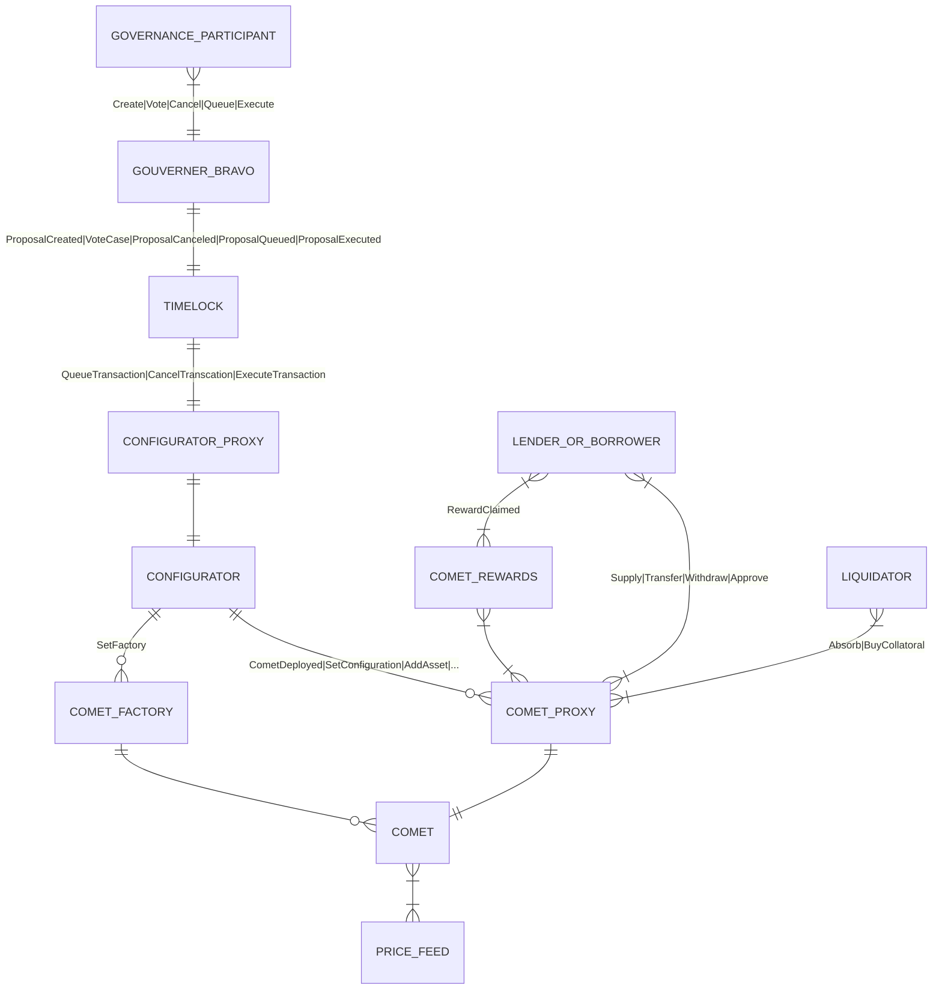

# Deployments

-   Ethereum Mainnet:
    -   [Hosted Subgraph](https://thegraph.com/hosted-service/subgraph/papercliplabs/compound-v3)

# Usage Notes

-   All percentages are represented as decimals in [0.0, 1.0]
-   baseTransfer will not emit any events if all value changed is on the borrow side. For this reason, the subgraph will not track base transfers, as this will be incomplete anyhow. Thus, it means that positions that did baseTransfers may be out of date until they do another interaction with the market. Could add handler to Transfer that just performs update to make it "less wrong"

# Compound v3 Contract Block Diagram Overview



# Subgraph Development

```bash
yarn
```

```bash
yarn codegen
```

```bash
yarn build
```

```bash
yarn deploy --access-token <access_token>
```
