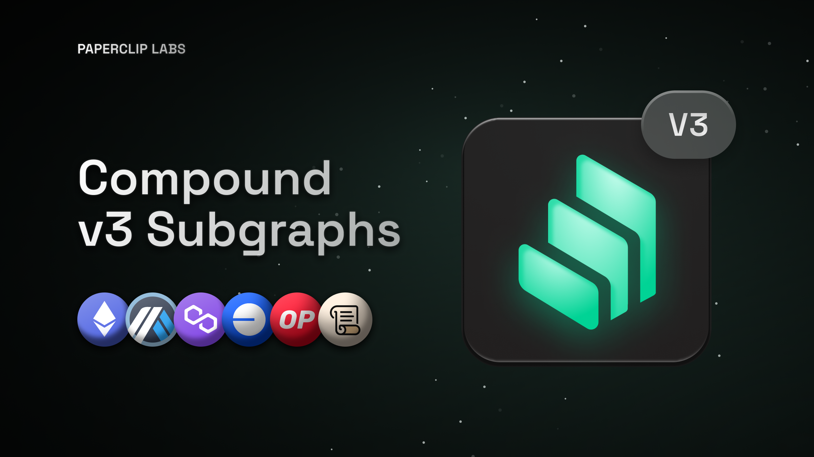
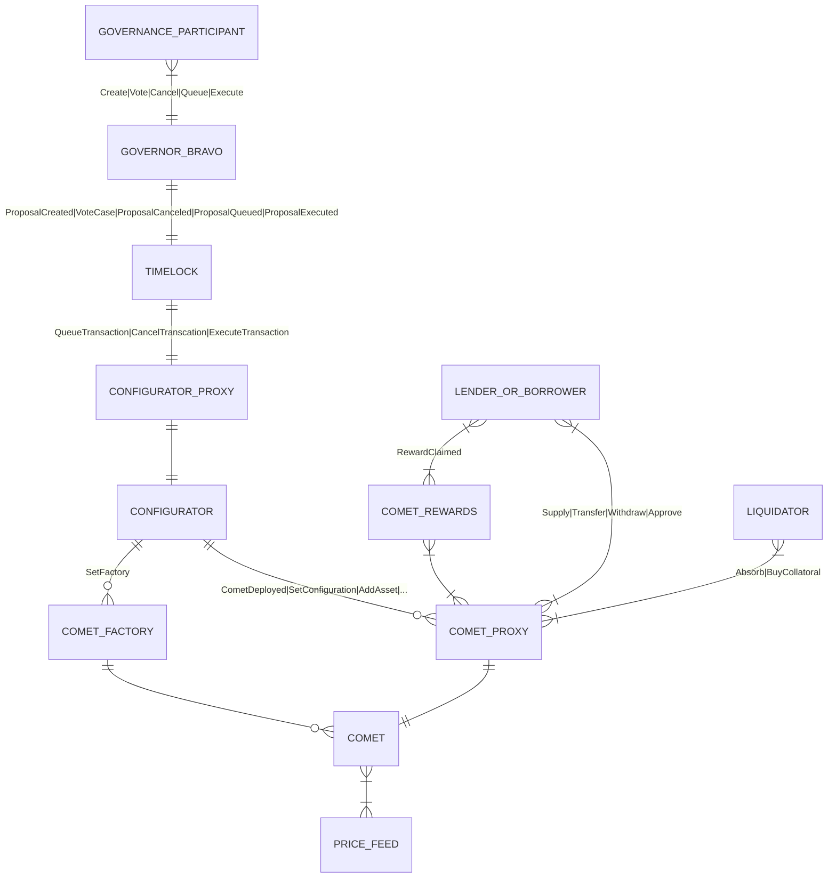

# Compound V3 Community Subgraphs



Compound V3 Community Subgraphs are the most comprehensive data source for developers looking to integrate Compound v3 protocol data into their decentralized applications (dApps)

## Deployments

### Mainnets

| Blockchain Network | Deployment (The Graph Decentralized Network)                                                                                      |
| ------------------ | --------------------------------------------------------------------------------------------------------------------------------- |
| Ethereum mainnet   | [Subgraph](https://thegraph.com/explorer/subgraphs/5nwMCSHaTqG3Kd2gHznbTXEnZ9QNWsssQfbHhDqQSQFp?view=Overview&chain=arbitrum-one) |
| Polygon            | [Subgraph](https://thegraph.com/explorer/subgraphs/AaFtUWKfFdj2x8nnE3RxTSJkHwGHvawH3VWFBykCGzLs?view=Overview&chain=arbitrum-one) |
| Arbitrum           | [Subgraph](https://thegraph.com/explorer/subgraphs/Ff7ha9ELmpmg81D6nYxy4t8aGP26dPztqD1LDJNPqjLS?view=Overview&chain=arbitrum-one) |
| Base               | [Subgraph](https://thegraph.com/explorer/subgraphs/2hcXhs36pTBDVUmk5K2Zkr6N4UYGwaHuco2a6jyTsijo?view=Overview&chain=arbitrum-one) |
| Optimism           | [Subgraph](https://thegraph.com/explorer/subgraphs/FhHNkfh5z6Z2WCEBxB6V3s8RPxnJfWZ9zAfM5bVvbvbb?view=Overview&chain=arbitrum-one) |
| Scroll             | [Subgraph](https://thegraph.com/explorer/subgraphs/6aRGn6noEdin1krLfYTnLMYaCoTujL7cHekARE4Ndxng?view=Overview&chain=arbitrum-one) |

### Testnets

| Blockchain Network | Subgraph                                                                                                                          |
| ------------------ | --------------------------------------------------------------------------------------------------------------------------------- |
| Sepolia            | [Subgraph](https://thegraph.com/explorer/subgraphs/HZKpJGBKpiBhKBqQuWAiR1xCAPhrsrmGYWpQavi23DR1?view=Overview&chain=arbitrum-one) |
| Base Sepolia       | [Subgraph](https://thegraph.com/explorer/subgraphs/CrbZvEXz5vmphoSg4gauxQd33zxMQwgmErA8HeQiPb2N?view=Overview&chain=arbitrum-one) |

### API Key

You will need an API Key from The Graph to query these subgraphs. They provide a generous free plan.
You can read the docs on how to set this up here: https://thegraph.com/docs/en/subgraphs/querying/introduction/

# Usage Notes

-   All percentages are represented as decimals in [0.0, 1.0]
-   baseTransfer will not emit any events if all value changed is on the borrow side. For this reason, it it possible that positions that did baseTransfers may be out of date until interaction happens involving that position do another interaction with the market. There is an issue open in Compound's comet repo here to add this event: https://github.com/compound-finance/comet/issues/816
-   All interactions to the comet contract emit a specific event except for except for baseTransfer (see above^). Also, the `Transfer` event gets omitted anytime the cToken balances change, for this reason we update accounting on a Transfer event (which is generally redundant, except for the special case described above). For this reason, we don't explicitly track this interaction for usage as this would result in duplicate counting.
-   USD balances are as of the last time an entity got updated. If there are no entity updates for a long period the "current" values will not be very accurate and should be instead constructed using the token balance and the current token price pulled from elsewhere.

# Compound v3 Contract Block Diagram Overview



# Subgraph Development

> In the below commands, replace <network> with one of [mainnet, polygon, arbitrum-one, base, goerli]

Install dependencies:

```bash
yarn
```

Copy .env.example to .env and populate it

```
cp .env.example .env
```

Run code generation

```bash
yarn codegen
```

Build

```bash
yarn build:<network> 
```

Deploy to the subgraph studio

```bash
yarn deploy-studio:<network>
```

Codegen, build and deploy in one command
```bash
yarn auto-deploy:<network> v<version (X.Y.Z)>

# Example
yarn auto-deploy:mainnet v0.0.1
```

# Validation

Validation is summarized in [this spreadsheet](https://docs.google.com/spreadsheets/d/1LWKhGglj5AQbRJOgTfqkDOssok-QBzzifwl1gk8rxCc/edit#gid=1642772597)

Helpers used to derive the data for validation can be found in:

-   Jupyter notebook [query.ipynb](./validation/query.ipynb): used to query subgraph and plot data
-   The script [directContract.ts](./validation/directContract.ts): used to read comet contracts at specified blocks to compare with the subgraph

to run directContract.ts

```bash
cd validation
yarn install
ts-node directContract.ts
```
